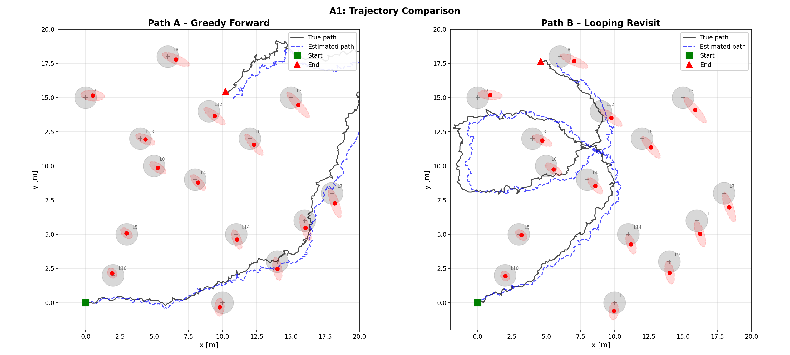
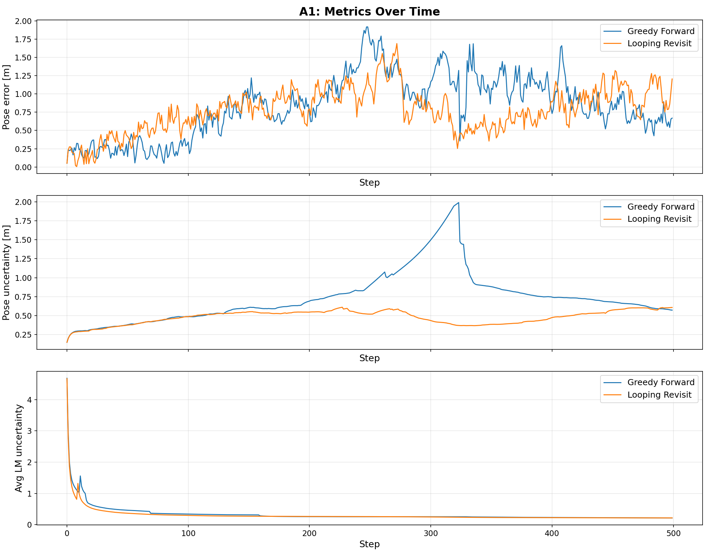
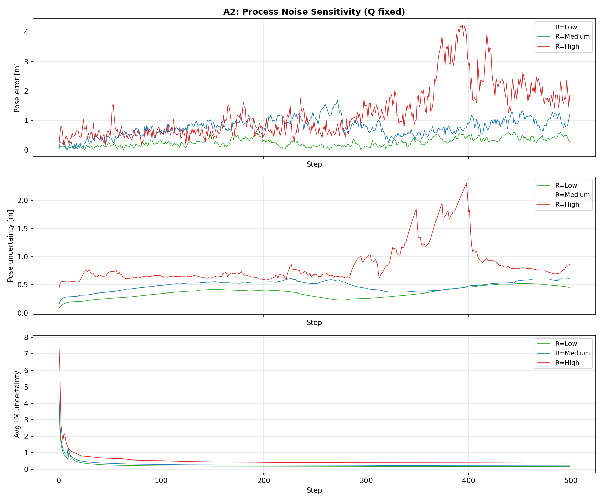
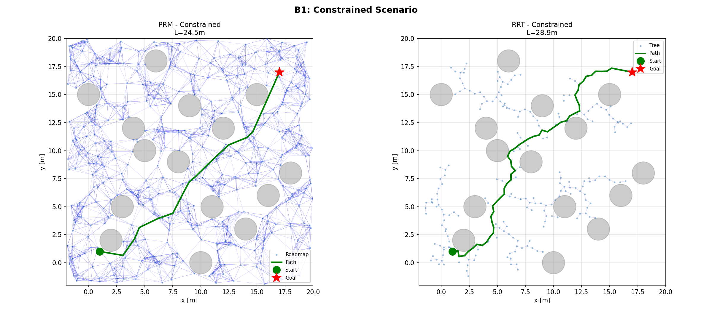
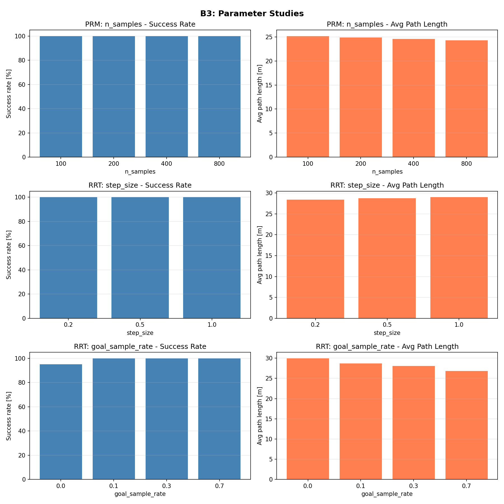
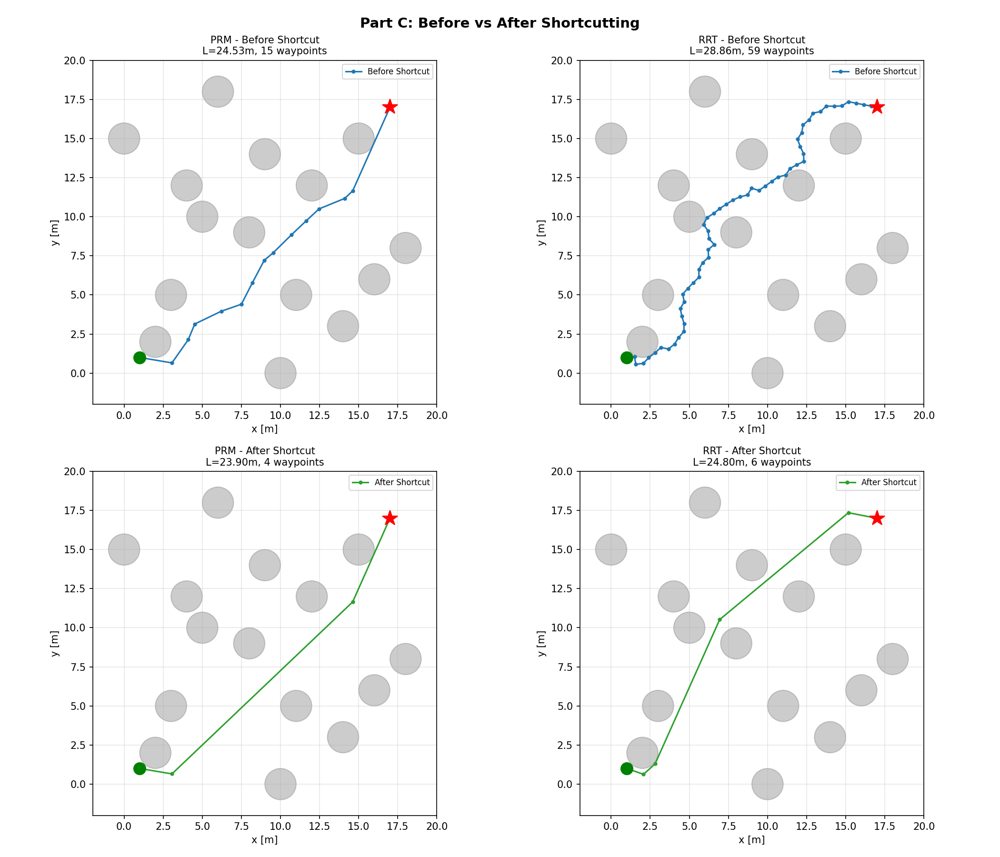

# CS188 Coding Assignment 3: SLAM and Motion Planning — Report

---

## Part A: EKF-SLAM — Trajectory and Uncertainty

### A1. Path Design: Which Trajectory is Better for SLAM?

I designed two qualitatively different control strategies in the same 15-landmark environment.

- **Path A — "Greedy Forward"**: L-shaped sweep — straight east (150 steps), turn left, straight north (150 steps), turn left, straight west. Each landmark observed once or twice.
- **Path B — "Looping / Revisit"**: Heads northeast, enters tight orbital loops (w=0.25), translates, then does a second orbit. Landmarks near orbits observed 4–8 times each.

**Quantitative Results (500 steps, medium noise):**

| Metric                  | Greedy Forward | Looping Revisit |
|-------------------------|----------------|-----------------|
| Final pose error        | 0.669 m        | 1.204 m         |
| Mean pose error         | 0.837 m        | 0.775 m         |
| Final pose uncertainty  | 0.572 m        | 0.607 m         |
| Final avg landmark unc. | 0.215          | 0.217           |
| Landmarks observed      | 15/15          | 15/15           |

**Which path leads to lower pose error and lower map uncertainty?**
Greedy Forward achieves lower *final* pose error (0.669 vs 1.204 m) and slightly lower final uncertainty. However, the Looping path achieves lower *mean* pose error (0.775 vs 0.837 m) because frequent re-observations trigger EKF corrections that pull the estimate back toward truth. The greedy path accumulates drift in long straight segments but ends near landmarks that anchor the final estimate. Final landmark uncertainties are nearly identical (~0.215), since both paths observe all 15 landmarks.

**Uncertainty ellipse behavior.** Under Path A, ellipses shrink when first observed but stay fixed afterward. Under Path B, ellipses near orbit centers continue shrinking with each pass.

**Concrete revisit example.** In Path B, the robot orbits near landmarks L4 (8,9), L0 (5,10), and L6 (12,12). On the first pass (~step 50–100), these are initialized with large uncertainty. Each subsequent orbit re-observes them from different angles; the EKF update computes Kalman gain K proportional to current uncertainty, and each correction reduces the landmark covariance. This is visible in Figure 2 where average landmark uncertainty drops steeply during the first orbit and continues decreasing.

### A2. Noise Sensitivity

I used Path B for the noise study because its repeated observations make it the stronger baseline.

| R Level | sigma_xy | sigma_theta | Pose Err |   | Q Level | sigma_range | sigma_bearing | Pose Err |
|---------|----------|-------------|----------|---|---------|-------------|---------------|----------|
| Low     | 0.05     | 1.5 deg     | 0.278 m  |   | Low     | 0.2         | 3.0 deg       | 1.263 m  |
| Medium  | 0.10     | 3.0 deg     | 1.204 m  |   | Medium  | 0.5         | 8.0 deg       | 1.204 m  |
| High    | 0.30     | 8.0 deg     | 1.857 m  |   | High    | 1.5         | 15.0 deg      | 1.351 m  |

*Process noise* has a dramatic effect: Low to High increases pose error 6.7x (0.278 to 1.857 m) because it corrupts true motion every timestep. *Measurement noise* has a much smaller effect (1.204 to 1.351 m) because repeated observations average out sensor noise.

**Process noise is clearly more damaging.** A 6x increase in process noise std causes 6.7x more error, while 7.5x more measurement noise causes only 1.1x more error. Process noise corrupts the state at every predict step (500 times), whereas measurement noise only affects corrections and is mitigated by repeated observations.

**Does the looping path still work under high noise?** The filter never diverges and all landmarks are observed, but high process noise degrades performance to 1.857 m error. Under high measurement noise the trajectory is remarkably robust (1.351 m), confirming that revisiting landmarks provides redundancy against sensor noise.

---

## Part B: PRM vs RRT — Planning Comparison

### B1. Start/Goal Scenarios

- **Scenario 1 — "Open"**: Obstacle radius 0.8, start=[1,1], goal=[19,1]. Wide gaps.
- **Scenario 2 — "Constrained"**: Obstacle radius 1.0, start=[1,1], goal=[17,17]. Tighter passages.

**Prediction:** PRM should produce shorter paths (A* on roadmap) but be slower. RRT might struggle with narrow passages but should be faster.

### B2. Metrics Comparison (Constrained Scenario, N=30 trials)

| Metric          | PRM     | RRT     |
|-----------------|---------|---------|
| Success rate    | 100%    | 100%    |
| Avg path length | 24.48 m | 28.72 m |
| Avg time        | 1.762 s | 0.068 s |
| Avg nodes       | 500     | 217     |

Both achieve 100% success. PRM produces 15% shorter paths (A* optimality on roadmap vs RRT's first-feasible approach). RRT is 26x faster since it doesn't build a full roadmap. RRT paths contain zigzags from random tree growth; PRM's weakness is planning time.

### B3. Parameter Studies

**PRM — n_samples:**

| n_samples | Success | Avg Length |
|-----------|---------|------------|
| 100       | 100%    | 25.17 m    |
| 200       | 100%    | 24.85 m    |
| 400       | 100%    | 24.57 m    |
| 800       | 100%    | 24.27 m    |

8x more samples yields only 3.6% shorter paths — diminishing returns. 200–400 is a sweet spot.

**RRT — step_size:** Minimal effect (28.40–28.98 m across 0.2–1.0). Smaller steps give finer navigation around obstacles but need more iterations.

**RRT — goal_sample_rate:**

| goal_rate | Success | Avg Length |
|-----------|---------|------------|
| 0.0       | 95%     | 29.97 m    |
| 0.1       | 100%    | 28.72 m    |
| 0.3       | 100%    | 28.10 m    |
| 0.7       | 100%    | 26.84 m    |

Goal bias has the strongest effect: zero bias drops success to 95%; 0.7 bias yields 10% shorter paths. High bias works here because paths to the goal are relatively unobstructed. In environments with obstacles blocking the direct route, high bias could waste iterations.

---

## Part C: Improving PRM and RRT

### Improvement: Path Shortcutting (Post-Processing)

I implemented a shortcutting algorithm as post-processing for both planners. For 200 iterations: randomly pick two non-adjacent waypoints i, j; if the straight line between them is collision-free, remove all intermediate waypoints. This addresses both planners' tendency to follow roadmap/tree structure rather than the shortest collision-free route.

**Results (20 trials, constrained scenario):**

| Planner | Len Before | Len After | Len Reduction | WP Before | WP After | WP Reduction |
|---------|------------|-----------|---------------|-----------|----------|--------------|
| PRM     | 24.50 m    | 24.03 m   | 2.0%          | 14.8      | 4.5      | 69.5%        |
| RRT     | 28.72 m    | 24.46 m   | 14.8%         | 59.0      | 5.4      | 90.9%        |

RRT benefits dramatically: 14.8% length reduction and 91% fewer waypoints, because RRT paths contain many small incremental steps that are easily shortcut. PRM benefits less in length (2.0%) since A* already finds near-optimal roadmap paths, but still reduces waypoints by 70%. After shortcutting, both planners converge to ~24 m, suggesting this is near the true shortest collision-free path. The improvement is simple, effective, and closes the quality gap between RRT and PRM at negligible cost — exactly as expected.

**Use of AI Tools.**
I used Claude Code (an AI coding assistant) to write the experiment scripts (`experiment_slam.py`, `experiment_planning.py`, `experiment_improve.py`, `path_utils.py`) including plotting and metric collection. I designed the experimental parameters and the AI implemented the scripts. I verified all scripts ran correctly and inspected outputs. The analysis and written explanations in this report are my own.
